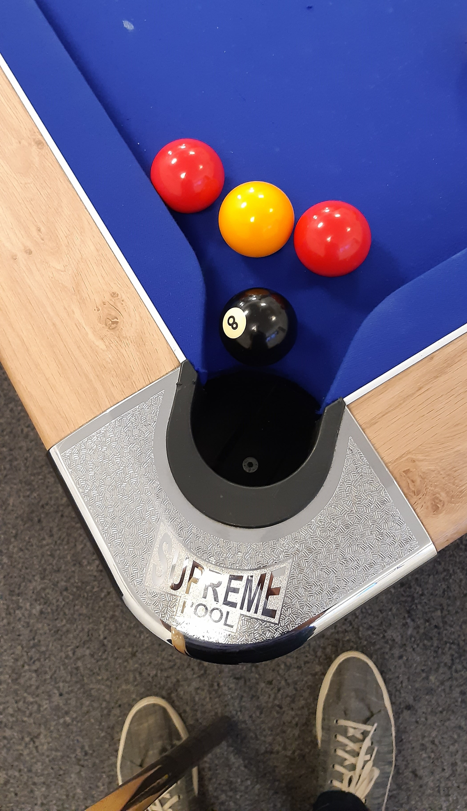

# CyberStart Elite 2019
## A vist to SkyGarden, a week in the capital and a SANS FOR500 course!
### JakeNTech, August 2019
At the start of the second year for Cyber Discovery I was invited to carry on with the program, for what I thought was going to be my last year. The first year was amazing, so many interesting, with some mega frustrating, challenges. Somehow, I even manged to make it to CyberStart Elite in the first year (I still do not know how!). When Game began, I saw that a new base had been added, a forensic one;I began work on this straight away. Trying to balance coursework was tricky (Due to the amount of work that needed to be done, and the duck was sometimes just too appealing to spend an afternoon playing with!) but I managed to squeeze it all in along with Cyber Discovery. After having completed to the forensic base, I moved on to continue with my progress with game, I ended Game with 98% Completion; though this was higher than my completion last year I felt as if it wasn't enough, as many other people had completed all of it. After Game, Essentials rolled out and we were given the chance to re-do the end of module tests, to which I started to do, but it soon became apparent that I would not be able to juggle this, revision, BTEC coursework and the duck. I sat down and did all I could, under the illusion that I probably had not done enough to make it to the next phase. Of all the content that was given on Game and Essentials the one that I found the most enjoyable was forensics, I cannot explain why other then it was just interesting!

During some Computer Science revision, well listening Craig ‘n’ Dave while playing GTA V, the email congratulating me on making it through to elite landed in my inbox! I kid you not I had to re-read the email a few times to make sure that I had indeed seen it correctly. However, it was true. I really had made it through to the elite phase! (YAY!)
There was the option to pick which SANS course we would like to take SEC504 and FOR500, as I found the forensics stuff the most interesting (and it was to be hosted in London) I choose to take FOR500. But because of the start time it would mean traveling in at rush hour, something both me and my dad wanted to avoid at all costs, so we booked into a hotel in Farringdon the day before, it also made traveling on the train cheaper. I was kind of nervous about the week ahead, spending a week with people who I had only really spoken too online a few times, I especial active (If at all) on the community discord server. However, those thoughts ran away as we got to sky garden. Check in the next day was at 9 ish, and so in the rain we walked the two(ish) miles to university.
Once I had been checked in and had a chat with a tonne of people, who were all super friendly, we were shown into the room where the course was going to be fed to us; We had the awesome Kevin Ripa as our instructor, who made the course even more exciting. Huge amounts of valuable information were shared with us about digital forensics and computing in general. The windows registry was one of the most enjoyable things taught, IMO. Up until a few weeks prior the registry was something that could potentially break my PC if I started tinkering with it too much (And a way to activate windows XP on test VM’s); but now it’s a source of all sorts of information that can giveaway what you were up to on a system, such as shell bags and user assist. Some of the other super interesting things that we were taught where o-alerts and browser forensics. I also picked up that Windows 10 phones home a lot and that in-private browsing is not all to private. There was also a rang of other activities laid out for us which where all epic!
On the last day we had the opportunity to take on a real world example of a case to solve, which was super intense but was great to put what we had been taught to good use, it was super enjoyable if a bit tense and frustrating at times! Trying to work out what the data we were looking at meant and how it even got there!
Another truly amazing part of the course was that we were all given a Forensic Computer Write-Blocker; this prevents any connected drive from having data written to (Essential in an investigation). I have a pile of old IDE and SATA II drives that could hold a lot of information, and soon I will be able to find out some stuff about the younger me, and possibly carve out some deleted files that went missing all them years ago, and see if any of the IDE hard drive in the pile still work!
This week was invaluable for what I want to do going forward. Not only was this week great for this course, but it was also amazing to meet the others who had made it there! My confidence was boosted no end, I feel truly proud to have attended such an event! I cannot wait to move on and start studying this full time at university! I am hoping to start teaching myself some more to do with forensics, such has how to fully understand a email header and do some research into how the Windows time-line can be used in a forensic way (If it can be used). Thanks to all those involved with making it so awesome! Better start getting ready to sit the GCFE exam!
[If you are are interested in trying out CyberDiscovery or just want to find out more, the link to the site can be found here!](https://joincyberdiscovery.com/)